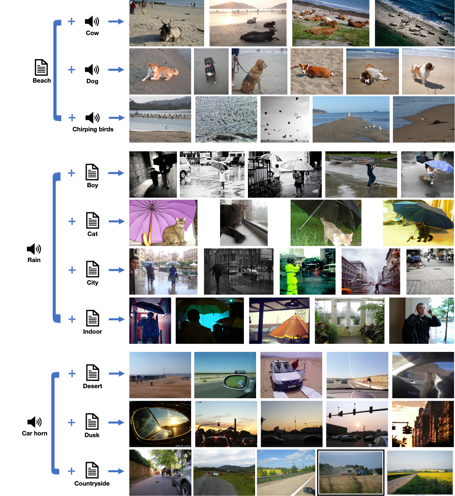

<!---
Copyright 2023 The OFA-Sys Team. 
All rights reserved.
This source code is licensed under the Apache 2.0 license found in the LICENSE file in the root directory.
-->


<p align="center">
    <br>
    
    <br>
<p>
<p align="center">
        <a href="https://arxiv.org/abs/2305.11172">Paper</a>&nbsp&nbsp ｜ &nbsp&nbsp<a href="https://huggingface.co/spaces/OFA-Sys/ONE-PEACE_Multimodal_Retrieval">Demo</a>&nbsp&nbsp | &nbsp&nbsp<a href="checkpoints.md">Checkpoints</a>&nbsp&nbsp ｜ &nbsp&nbsp<a href="datasets.md">Datasets</a>&nbsp&nbsp | &nbsp&nbsp<a href="https://modelscope.cn/models/damo/ONE-PEACE-4B/summary">ModelScope</a>
</p>
<br>

ONE-PEACE is a general representation model across vision, audio, and language modalities,
Without using any vision or language pretrained model for initialization, ONE-PEACE achieves leading results in vision, 
audio, audio-language, and vision-language tasks.
Furthermore, ONE-PEACE possesses a strong emergent zero-shot retrieval capability, enabling it to align modalities
that are not paired in the training data.

Below shows the architecture and pretraining tasks of ONE-PEACE.
With the scaling-friendly architecture and modality-agnostic tasks, ONE-PEACE has the potential to expand to unlimited modalities.

<p align="center">

</p>

<br>

# Online Demo
We provide the [online demo](https://huggingface.co/spaces/OFA-Sys/ONE-PEACE_Multimodal_Retrieval) in Huggingface Spaces. In this demo, you can combine multiple modalities to retrieve related images, such as audio-to-image, audio+text-to-image, audio+image-to-image, and even audio+image+text-to-image.

<p align="center">

</p>
<br>

# News
* **2023.6.04:** Released the pretraining scripts. See [guidance for pretraining](one_peace/README.md/##Pretraining) for more details.
* **2023.5.30:** Released the finetuned checkpoints and scripts for audio(-language) tasks.
* **2023.5.29:** Released the finetuned checkpoints for vision-language tasks.
* **2023.5.27:** 🔥 We have provided the [multimodal retrieval demo](https://huggingface.co/spaces/OFA-Sys/ONE-PEACE_Multimodal_Retrieval) in huggingface spaces. Have Fun!
* **2023.5.25:** Released the [easy-to-use API](#api), which enables the quick extraction for image, audio and text representations.
* **2023.5.23:** Released the [pretrained checkpoint](checkpoints.md), as well as [finetuning & inference scripts](one_peace/README.md) for vision-language tasks.
* **2023.5.19:** Released the paper and code. Pretrained & finetuned checkpoints, training & inference scripts, as well as demos will be released as soon as possible.
<br></br>

# Models and Results
## Model Card
We list the parameters and pretrained checkpoints of ONE-PEACE below. Note that ONE-PEACE can be disassembled into different branches to handle different tasks.
We also provide the vision-branch of ONE-PEACE, which can be used to perform vision tasks.

<table border="1" width="100%">
    <tr align="center">
        <th>Model</th><th>Ckpt</th><th>Params</th><th>Hidden size</th><th>Intermediate size</th><th>Attention heads</th><th>Layers</th>
    </tr>
    <tr align="center">
        <td>ONE-PEACE</td><td><a href="http://one-peace-shanghai.oss-accelerate.aliyuncs.com/one-peace.pt">Download</a></td><td>4B</td><td>1536</td><td>6144</td><td>24</td><td>40</td>
    </tr>
    <tr align="center">
        <td>ONE-PEACE<br>(Vision Branch)</td><td><a href="https://one-peace-shanghai.oss-accelerate.aliyuncs.com/one_peace_checkpoints/one-peace-vision.pkl">Download</a></td><td>1.5B</td><td>1536</td><td>6144</td><td>24</td><td>40</td>
    </tr>
</table>
<br>

## Results
### Vision Tasks
<table border="1" width="100%">
    <tr align="center">
        <th>Task</th><th>Image classification</th><th>Semantic Segmentation</th><th>Object Detection (w/o Object365)</th><th>Video Action Recognition</th>
    </tr>
    <tr align="center">
        <td>Dataset</td><td>Imagenet-1K</td><td>ADE20K</td><td>COCO</td><td>Kinetics 400</td>
    </tr>
    <tr align="center">
        <td>Split</td><td>val</td><td>val</td><td>val</td><td>val</td>
    </tr>
    <tr align="center">
        <td>Metric</td><td>Acc.</td><td>mIoU<sup>ss</sup> / mIoU<sup>ms</sup></td><td>AP<sup>box</sup> / AP<sup>mask</sup></td><td>Top-1 Acc. / Top-5 Acc.</td>
    </tr>
    <tr align="center">
        <td>ONE-PEACE</td><td>89.8</td><td>62.0 / 63.0</td><td>60.4 / 52.9</td><td>88.1 / 97.8</td>
    </tr>
</table>

### Audio(-language) Tasks
<table border="1" width="100%">
    <tr align="center">
        <th>Task</th><th colspan="4">Audio-Text Retrieval</th><th colspan="3">Audio Classification</th><th>Audio Question Answering</th>
    </tr>
    <tr align="center">
        <td>Dataset</td><td colspan="2">AudioCaps</td><td colspan="2">Clotho</td><td>ESC-50</td><td>FSD50K</td><td>VGGSound (Audio Only)</td><td>AVQA (Audio + Question)</td>
    </tr>
    <tr align="center">
        <td>Split</td><td colspan="2">test</td><td colspan="2">evaluation</td><td>full</td><td>eval</td><td>test</td><td>val</td>
    </tr>
    <tr align="center">
        <td>Metric</td><td>T2A R@1</td><td>A2T R@1</td><td>T2A R@1</td><td>A2T R@1</td><td>Zero-shot Acc.</td><td>MAP</td><td>Acc.</td><td>Acc.</td>
    </tr>
    <tr align="center">
        <td>ONE-PEACE</td><td>42.5</td><td>51.0</td><td>22.4</td><td>27.1</td><td>91.8</td><td>69.7</td><td>59.6</td><td>86.2</td>
    </tr>
</table>

### Vision-Language Tasks
<table border="1" width="100%">
    <tr align="center">
        <th>Task</th><th colspan="4">Image-Text Retrieval (w/o ranking)</th><th colspan="3">Visual Grounding</th><th>VQA</th><th>Visual Reasoning</th>
    </tr>
    <tr align="center">
        <td>Dataset</td><td colspan="2">COCO</td><td colspan="2">Flickr30K</td><td>RefCOCO</td><td>RefCOCO+</td><td>RefCOCOg</td><td>VQAv2</td><td>NLVR2</td>
    </tr>
    <tr align="center">
        <td>Split</td><td colspan="2">test</td><td colspan="2">test</td><td>val / testA / testB</td><td>val / testA / testB</td><td>val-u / test-u</td><td>test-dev / test-std</td><td>dev / test-P</td>
    </tr>
    <tr align="center">
        <td>Metric</td><td>I2T R@1</td><td>T2I R@1</td><td>I2T R@1</td><td>T2I R@1</td><td colspan="3">Acc@0.5</td><td>Acc.</td><td>Acc.</td>
    </tr>
    <tr align="center">
        <td>ONE-PEACE</td><td>84.1</td><td>65.4</td><td>97.6</td><td>89.6</td><td>92.58 / 94.18 / 89.26</td><td>88.77 / 92.21 / 83.23</td><td>89.22 / 89.27</td><td>82.6 / 82.5</td><td>87.8 / 88.3</td>
    </tr>
</table>
<br></br>


# Requirements and Installation
* Python >= 3.7
* Pytorch >= 1.10.0 (recommend 1.13.1)
* CUDA Version >= 10.2 (recommend 11.6)
* Install required packages:
```bash
git clone https://github.com/OFA-Sys/ONE-PEACE
cd ONE-PEACE
pip install -r requirements.txt
```
* For faster training install [Apex](https://github.com/NVIDIA/apex) library (optional):
```bash
git clone https://github.com/NVIDIA/apex
cd apex && pip install -v --disable-pip-version-check --no-cache-dir --global-option="--cpp_ext" --global-option="--cuda_ext" --global-option="--distributed_adam" --global-option="--deprecated_fused_adam" ./
```
* Install [Xformers](https://github.com/facebookresearch/xformers) library to use Memory-efficient attention (optional):
```bash
conda install xformers -c xformers
```
* Install [FlashAttention](https://github.com/HazyResearch/flash-attention) library to use faster LayerNorm (optional):
```bash
git clone --recursive https://github.com/HazyResearch/flash-attention
cd flash-attn && pip install .
cd csrc/layer_norm && pip install .
```
<br>

# Datasets and Checkpoints
See [datasets.md](datasets.md) and [checkpoints.md](checkpoints.md).
<br></br>

# Usage
## API
We provide a simple code snippet to show how to use the API for ONE-PEACE.
We use ONE-PEACE to compute embeddings for text, images, and audio, as well as their similarities:
```python
import torch
from one_peace.models import from_pretrained

device = "cuda" if torch.cuda.is_available() else "cpu"
# "ONE-PEACE" can also be replaced with ckpt path
model = from_pretrained("ONE-PEACE", device=device, dtype="float32")

# process raw data
src_tokens = model.process_text(["cow", "dog", "elephant"])
src_images = model.process_image(["demo_assets/dog.JPEG", "demo_assets/elephant.JPEG"])
src_audios, audio_padding_masks = model.process_audio(["demo_assets/cow.flac", "demo_assets/dog.flac"])

with torch.no_grad():
    # extract normalized features
    text_features = model.extract_text_features(src_tokens)
    image_features = model.extract_image_features(src_images)
    audio_features = model.extract_audio_features(src_audios, audio_padding_masks)

    # compute similarity
    i2t_similarity = image_features @ text_features.T
    a2t_similarity = audio_features @ text_features.T

print("Image-to-text similarities:", i2t_similarity)
print("Audio-to-text similarities:", a2t_similarity)
```

## Training & Inference
In addition to the API, we also provide the instructions of training and inference in [getting_started](one_peace/README.md).

<br></br>

# Gallery

## Visual Grounding (unseen domain)


## Emergent Zero-shot Retrieval





<br></br>

# Acknowledgement
* [Fairseq](https://github.com/pytorch/fairseq) A sequence modeling toolkit with flexible configuration and highly extensible code structure.
* [xFormers](https://github.com/facebookresearch/xformers) A toolbox to accelerate research on Transformers.
* [FlashAttention](https://github.com/HazyResearch/flash-attention) A repository that provides the official implementation of FlashAttention, which greatly speeds up multi-head attention.
* [Apex](https://github.com/NVIDIA/apex) A repository that provides useful model acceleration and memory optimization techniques.
<br></br>

# Getting Involved
Feel free to submit Github issues or pull requests. Welcome to contribute to our project!

To contact us, never hestitate to send an email to `zheluo.wp@alibaba-inc.com` or `saimeng.wsj@alibaba-inc.com`!
<br></br>

# Citation

If you find our paper and code useful in your research, please consider giving a star :star: and citation :pencil: :)

```BibTeX
@article{wang2023one,
  title={ONE-PEACE: Exploring One General Representation Model Toward Unlimited Modalities},
  author={Wang, Peng and Wang, Shijie and Lin, Junyang and Bai, Shuai and Zhou, Xiaohuan and Zhou, Jingren and Wang, Xinggang and Zhou, Chang},
  journal={arXiv preprint arXiv:2305.11172},
  year={2023}
}
```
